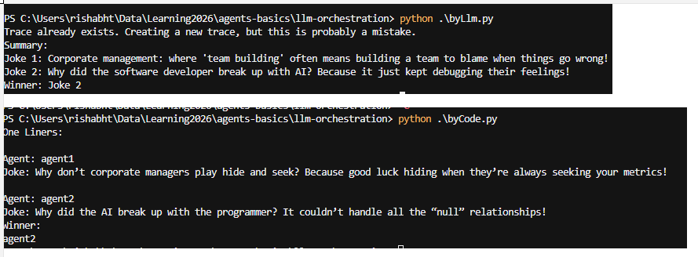
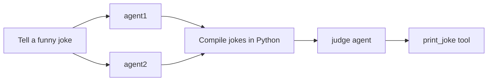
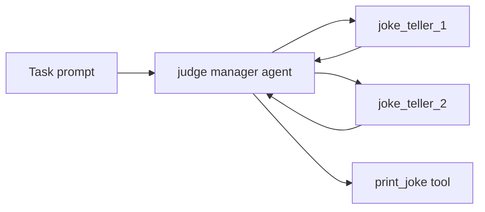

# LLM Orchestration Examples

Two ways to orchestrate multiple agents with the [OpenAI Agents SDK](https://openai.github.io/openai-agents-python/), using the same comedy-battle scenario: two comedians generate one-liner jokes; a judge picks the winner.

| Script | Pattern | Who controls the flow? |
|--------|---------|------------------------|
| [`byCode.py`](byCode.py) | **Orchestration by code** | Your Python code (`asyncio.gather`, `Runner.run`) |
| [`byLlm.py`](byLlm.py) | **Orchestration by LLM** | A manager agent decides which tools to call and when |

---



## Orchestration by code (`byCode.py`)

Your application code explicitly runs each step.

1. **agent1** and **agent2** run **in parallel** via `asyncio.gather`.
2. Outputs are compiled with agent names and printed.
3. A separate **judge** agent receives the compiled jokes and picks the winner.
4. The judge calls `print_joke` to announce the winning agent.



**Best when:** the workflow is fixed, you want predictable order/cost, or you need parallel execution under your control.

```bash
python byCode.py
```

---

## Orchestration by LLM (`byLlm.py`)

Comedian agents are exposed as **tools** (`joke_teller_1`, `joke_teller_2`) via `agent.as_tool()`. A single **judge** manager agent receives a task prompt and decides:

1. Call each joke-teller tool.
2. Evaluate the jokes.
3. Call `print_joke` with a summary of both jokes and the winner.



**Best when:** the workflow can vary, you want one agent to coordinate sub-agents, or you prefer describing steps in natural language instead of wiring `asyncio` yourself.

```bash
python byLlm.py
```

### View the agent graph

`byLlm.py` can visualize the judge agent and its tools with `draw_graph`:

```python
graph = draw_graph(judge)
graph.view()          # opens in default viewer
# or
draw_graph(judge, filename="judge_graph")  # saves judge_graph.png
```

Requires the **Graphviz system install** ([graphviz.org/download](https://graphviz.org/download/)) in addition to the Python `graphviz` package.

---

## Comparison

| | **byCode** | **byLlm** |
|---|------------|-----------|
| Flow defined in | Python (`judge_jokes`) | Judge agent instructions + task prompt |
| Comedian agents | Called directly with `Runner.run` | Wrapped as tools (`as_tool`) |
| Parallel jokes | Yes (`asyncio.gather`) | LLM calls tools sequentially or as it chooses |
| Predictability | High | Depends on model behavior |
| Visualization | N/A | `draw_graph(judge)` |

---

## Prerequisites

- **Python 3.12+**
- **OpenAI API key** — [platform.openai.com/api-keys](https://platform.openai.com/api-keys)
- **Graphviz** (optional, for `draw_graph` in `byLlm.py`) — [graphviz.org/download](https://graphviz.org/download/)

## Setup

```bash
cd llm-orchestration

python -m venv .venv

# Windows
.venv\Scripts\activate

# macOS / Linux
source .venv/bin/activate

pip install -r requirements.txt

cp .env.example .env
# Edit .env and add your OPENAI_API_KEY
```

## Corporate proxy (optional)

If API calls fail with SSL/certificate errors behind a corporate proxy, [`proxy_patch.py`](proxy_patch.py) disables SSL verification for `httpx` and `requests`. It is imported at the top of both scripts:

```python
import proxy_patch
```

- **Behind a corporate proxy:** keep this import.
- **Not behind a proxy:** remove or comment out `import proxy_patch`.

Only use when needed — disabling SSL verification is less secure.

## Environment variables

| Variable | Required | Description |
|----------|----------|-------------|
| `OPENAI_API_KEY` | Yes | OpenAI API key for the agents |
| `OPENAI_MODEL` | No | Model name (default: `gpt-4o-mini`) |

## Project layout

```
llm-orchestration/
├── byCode.py          # Orchestration by code
├── byLlm.py           # Orchestration by LLM (manager + tools)
├── proxy_patch.py     # Optional: SSL workaround for corporate proxies
├── requirements.txt
├── .env.example
├── .gitignore
└── README.md
```

## Traces

Both scripts use `with trace(...)` so runs appear on the [OpenAI Traces dashboard](https://platform.openai.com/traces).

## License

Use and modify as you like for learning and personal projects.
